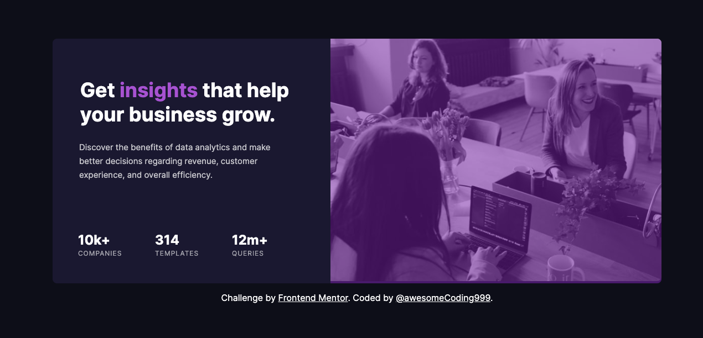
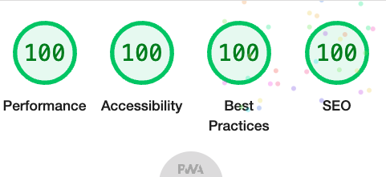

# Frontend Mentor - Stats preview card component solution<!-- omit in toc -->

## Desktop<!-- omit in toc -->



## Mobile<!-- omit in toc -->


## Table of contents<!-- omit in toc -->

- [Overview](#overview)
  - [The challenge](#the-challenge)
  - [Links](#links)
  - [Accessibility report](#accessibility-report)
- [My process](#my-process)
  - [Built with](#built-with)
  - [What I learned](#what-i-learned)
- [Author](#author)

## Overview

### The challenge

Users should be able to:

- View the optimal layout depending on their device's screen size

### Links

- [Live site](https://awesomecoding999.github.io/frontend-mentor-stats-preview-card/)
- [GitHub repo URL](https://github.com/awesomeCoding999/frontend-mentor-stats-preview-card)

### Accessibility report



## My process

### Built with

- Semantic HTML5 markup
- CSS custom properties
- CSS Flexbox
- Mobile-first workflow

### What I learned

I learned how to add a transparent colored overlay on top of the header image.

```css
.purple-overlay {
  position: relative;
}

.purple-overlay::before {
  content: "";
  display: block;
  position: absolute;
  top: 0;
  bottom: 0;
  left: 0;
  right: 0;
  height: 100%;
  background: var(--transparent-violet);
  border-top-left-radius: 8px;
  border-top-right-radius: 8px;
}
```

## Author

- Frontend Mentor - [@awesomeCoding999](https://www.frontendmentor.io/profile/awesomeCoding999)
